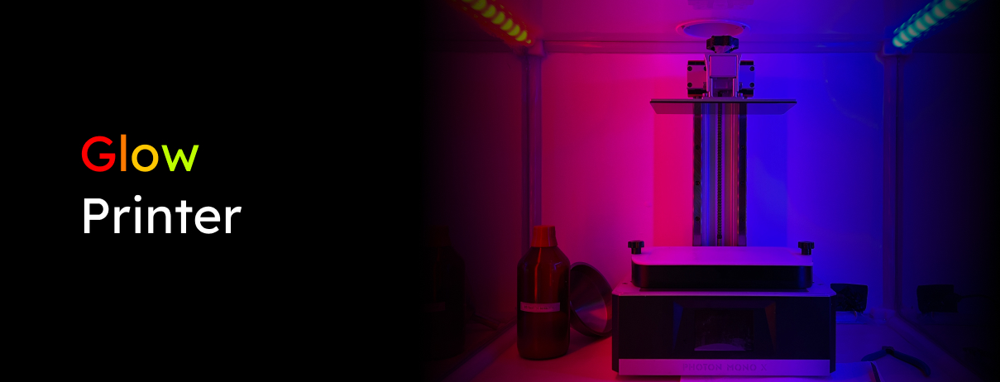
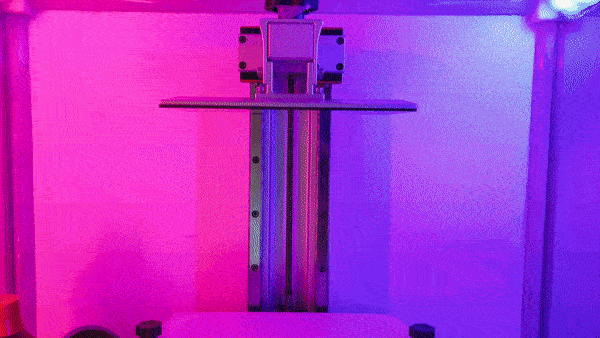

## What is this project?

This 3D printer case helps with containing your stinky 3D printer, while also making it look awesome and keeping it warm!

For 3D printers up to 50cm in height, 61cm width and 45cm depth.

Looking for the full 3D model of the project? [Download the "GlowPrinter case.step" file from GrabCAD](https://grabcad.com/library/glowprinter-1).

## Required tools

- lasercutter (with minimum work area of 70x60cm)
- 3D printer (tested with MSLA 3d printer, but every other 3D printer should work as well. With minimum print area of 7x7cm)
- screw driver (for M3 screws)
- silicone glue gun
- hot glue gun (recommended but not must have)

## Required materials

### Acrylic plates, 4mm thick

Make sure you get real acrylic or Plexiglas - which is compatible with a lasercutter.

- **2x** 68x52cm or larger, white
- **2x** 52x52cm or larger, transparent
- **1x** 68x52cm or larger, transparent

### Screws & nuts

- **40x** M3 12mm screws flat head (no angle)
- **3x** M3 10mm screws flat head (no angle)
- **24x** M3 8mm screws flat head (no angle)
- **8x** M3 12mm screw angled head
- **71x** M3 nuts (hexagon)

### For the LEDs & stability

- **2m** WS2812B LED strip (30 LEDs per meter, white)
- **1x** ESP8266 or ESP32
- **7m** V shape aluminium profile for 10mm wide LED strips

### For the air exhaust

- air exhaust pipe (100mm diameter, length depends on how far away your printer case will be from the wall or window you want to connect it to)
- **1x** duct fan (100mm diameter)
- **1x** air exhaust pipe to wall connector (100mm diameter)

### Other materials

- **50x166cm (or more)** UV-protective foil (optional for FDM printer, but mandatory for MSLA or SLA printers)
- **1 tube** silicone glue, transparent

## How to build the GlowPrinter

### **Step 1:** Lasercut the acrylic plates

### **Step 2:** Apply UV-protective foil

### **Step 3:** 3D print all the needed parts

### **Step 4:** Prepare the LED microcontroller

### **Step 4:** Prepare the aluminium profiles

Cut them to the correct length and solder LED strips with 1.25mm JST 3 pin connectors to the front left, front right, top left & top right aluminium profile.

- **4x** 46.5cm (front left,back left,front right,back right)
- **4x** 43.2cm (left bottom, left top, right bottom, right top)
- **3x** 61.5cm (front top, back top, back bottom)

### **Step 5:** Prepare the case ceiling

### **Step 6:** Prepare the doors

### **Step 7:** Connect the doors to the case sides

### **Step 8:** Build the case together

### **Step 9:** Place & screw it to your desk

### **Step 10:** Fill the gaps with silicone glue

### **Step 11:** Connect the air exhaust to your window or wall

### **Step 12:** Done - now enjoy your 3D printer case!

