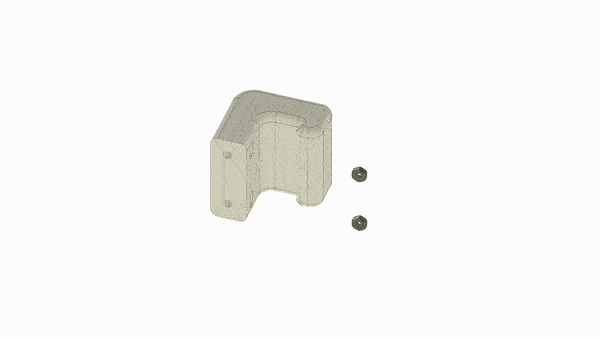

## What is this project?

This 3D printer case helps with containing your stinky 3D printer, while also making it look awesome and keeping it warm!

For 3D printers up to 50cm in height, 61cm width and 45cm depth.

Want to double check if you are building the case correctly? [Download the "GlowPrinter case.step" file from GrabCAD](https://grabcad.com/library/glowprinter-1).

## Required tools

- lasercutter (with minimum work area of 70x60cm)
- 3D printer (tested with MSLA 3d printer, but every other 3D printer should work as well. With minimum print area of 7x7cm)
- screw driver (for M3 screws)
- soldering equipment
- cutter knife
- silicone glue gun
- hot glue gun (recommended but not must have)

## Required materials

### Acrylic plates, 4mm thick

Make sure you get real acrylic or Plexiglas - which is compatible with a lasercutter.

- **2x** 68x52cm (or larger), white
- **2x** 52x52cm (or larger), transparent
- **1x** 68x52cm (or larger), transparent

### Screws & nuts

- **40x** M3 12mm screws flat head (no angle)
- **3x** M3 10mm screws flat head (no angle)
- **24x** M3 8mm screws flat head (no angle)
- **8x** M3 12mm screw angled head
- **71x** M3 nuts (hexagon)

### For the LEDs & stability

- **2m** WS2812B LED strip (30 LEDs per meter, white)
- **1x** ESP8266 or ESP32
- **2x** WAGO 221-413 connector
- **2x** WAGO 221-412 connector
- **4x** JST 1.25mm 3 pin connectors (4x male & 4x female connectors)
- wires
- **7m** V shape aluminium profile for 10mm wide LED strips

### For the air exhaust

- **2x** air exhaust pipe (100mm diameter, length depends on how far away your printer case will be from the wall or window you want to connect it to)
- **1x** duct fan (100mm diameter)
- **1x** air exhaust pipe to wall connector (100mm diameter)
- **1x** air exhaust pipe to case connector (100mm diameter)

### Other materials

- **2x** door magnet pairs (screw holes distance 35mm)
- **50x166cm (or more)** UV-blocking foil (optional for FDM printer, but mandatory for MSLA or SLA printers)
- **1 tube** silicone glue, transparent

## How to build the GlowPrinter

### **Step 1:** Lasercut the acrylic plates

- [front.dxf](https://github.com/glowingkitty/GlowPrinter/blob/main/lasercut%20acrylic%20parts/back.dxf) => on 68x52cm (or larger), transparent
- [back.dxf](https://github.com/glowingkitty/GlowPrinter/blob/main/lasercut%20acrylic%20parts/back.dxf) => on 68x52cm (or larger), white
- [top.dxf](https://github.com/glowingkitty/GlowPrinter/blob/main/lasercut%20acrylic%20parts/top.dxf) => on 68x52cm (or larger), white
- [left.dxf](https://github.com/glowingkitty/GlowPrinter/blob/main/lasercut%20acrylic%20parts/left.dxf) => on 52x52cm (or larger), transparent
- [right.dxf](https://github.com/glowingkitty/GlowPrinter/blob/main/lasercut%20acrylic%20parts/right.dxf) => on 52x52cm (or larger), transparent

And remove the protective foil on the acrylic AFTER lasercutting the plates.

### **Step 2:** Apply UV-blocking foil on the acrylic plates

Read the instructions of the UV-blocking foil and apply it accordingly on the acrylic plates (after you lasercut them). Then cut off the foil that sticks out and cut the holes free.

### **Step 3:** 3D print all the needed parts

3D print all the .3mf files (3D Manufacturing Format) in the ["/3D printed parts"](https://github.com/glowingkitty/GlowPrinter/tree/main/3D%20printed%20parts) folder. 

Tested with the Anycubic Photon Mono X and an 80/20 mix of [Siraya Tech Fast White](https://siraya.tech/products/fast-1kg-abs-like-white) and [Siraya Tech Tenacious](https://siraya.tech/products/tenacious-by-siraya-tech-for-lcd-resin-printers-1kg). But regular FDM prints with PLA or PETG should also work fine - and other resins as well, as long as they aren't very easy to break.

### **Step 4:** Prepare the LED microcontroller

Install [TheGlowingCore on your ESP](https://github.com/glowingkitty/TheGlowingCore#step-3-install-the-glowing-core-firmware-on-your-esp32). Then [setup the software via wifi](https://github.com/glowingkitty/TheGlowingCore#step-10-setup-the-software).

If everything works fine, solder a red wire to the 5V pin of your ESP and connect the other end to a WAGO 221-413 connector (follow WAGO's instructions on how to do that). Repeat the same with a white wire to the GND pin of your ESP and to another WAGO 221-413 connector. And now the same for two GPIO pins of your choice - and connect the other ends to two WAGO 221-412 connectors.

### **Step 5:** Prepare the aluminium profiles

Cut the V shaped aluminium profiles to the correct length.

- **4x** 46.5cm (front left,back left,front right,back right)
- **4x** 43.2cm (left bottom, left top, right bottom, right top)
- **3x** 61.5cm (front top, back top, back bottom)

Then connect the LED strips with JST 1.25mm 3 pin connectors to the front left, front right, top left & top right aluminium profile.

Let's test if your LED strips work! Connect your LED strips via the WAGO connectors to the ESP microcontroller. Then configure the LED strips in the software via the web interface - set the right number of LEDs and the two GPIO pins you selected in the settings - and select your desired animation and colors in the control interface.

Everything looks good? Perfect! Then we can continue.

### **Step 6:** Prepare the top plate

Start with fixating two door magnets to the front of the top plate, with the help of two M3 nuts and M3 12mm screws.

Then insert the air exhaust pipe to case connector into the hole of the top plate - and screw it together with three M3 nuts and M3 10mm screws.

### **Step 7:** Prepare the doors

Connect the door handle by placing an M3 nut inside, then screw it to one of the doors with two M3 12mm screws. Next, connect the flat parts of the door magnets at the top and bottom - by using two M3 nuts and M3 12mm screws with an angled head (not the flat head). Last, screw the hinges in place, with M3 nuts and M3 8mm screws with an angled head. Afterwards repeat the same steps with the other door.

### **Step 8:** Connect the doors to the case sides

### **Step 9:** Build the case together

- add M3 nuts to all the corner parts inside (pro tipp: use hot glue to block them from falling out)
- place the bottom and side aluminium profiles together with the corner parts in their correct position
- screw the side plates and the back plate together at the bottom
- place the top aluminium profiles on top, then place the top plate on top - and screw everything together
- make sure to not screw everything together super tight, before you have all the parts connected
- once you are done, tighten all the screws completely

### **Step 10:** Place the case to your desk

Place the full case carefully on your desk, where you want to have it. Once the case is in it's correct position, you can use some screws to fix the case to the desk and create a strong connection. This step is optional, but recommended.

### **Step 11:** Fill the gaps with silicone glue

There will be some small gaps remaining, between the right, left, back and top acrylic plates and desk. You can fill them by using silicone glue and a silicone glue gun.

### **Step 12:** Connect the air exhaust

Take an air exhaust tube and connect it to the 3D printer case. On the other side of the tube use the duct fan (best don't place it on the case, but somewhere else). And from there connect another tube to the wall or window.

### **Step 13:** Optional: connect the hole covers and air seal - or just tape to close the holes

### **Step 14:** Done - now enjoy your 3D printer case!

